# 🌟 Roxiler - Advanced Store Rating Platform

<div align="center">


**A modern, full-stack web application for comprehensive store rating and management with intelligent role-based access control**

[](https://reactjs.org/)
[](https://nodejs.org/)
[](https://postgresql.org/)
[](https://expressjs.com/)
[](LICENSE)

</div>

---

## 🚀 Overview

Roxiler is a cutting-edge store rating platform that empowers businesses and customers through a sophisticated three-tier user management system. Built with modern web technologies, it provides seamless interaction between system administrators, store owners, and customers through an intuitive, responsive interface.

### ✨ Key Highlights

- 🔐 **Unified Authentication System** - Single login portal for all user roles
- 👥 **Intelligent Role Management** - System Admin, Store Owner, and Customer roles
- ⭐ **Advanced Rating System** - 5-star rating with detailed comments
- 🎨 **Dynamic Theming** - Beautiful dark/light mode toggle
- 📱 **Responsive Design** - Perfect experience across all devices
- 🔒 **Enterprise Security** - JWT-based authentication with role-based access
- 📊 **Real-time Analytics** - Comprehensive dashboards and statistics

---

## 📸 Application Screenshots

### 🏠 Landing Page & Authentication
<div align="center">

| Landing Page | Login Interface |
|:---:|:---:|
| 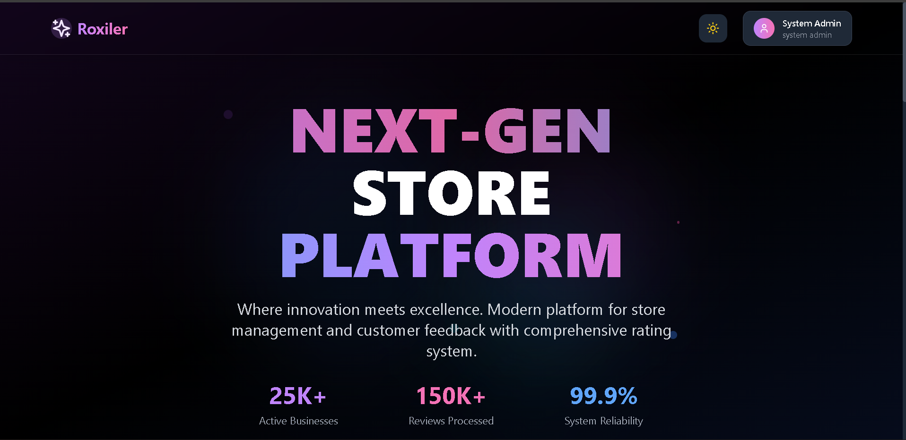 | 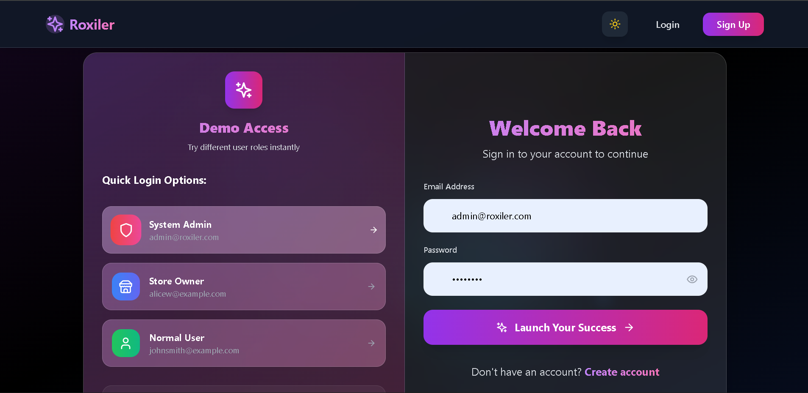 |

| Sign Up Page | Dark Mode Login |
|:---:|:---:|
| 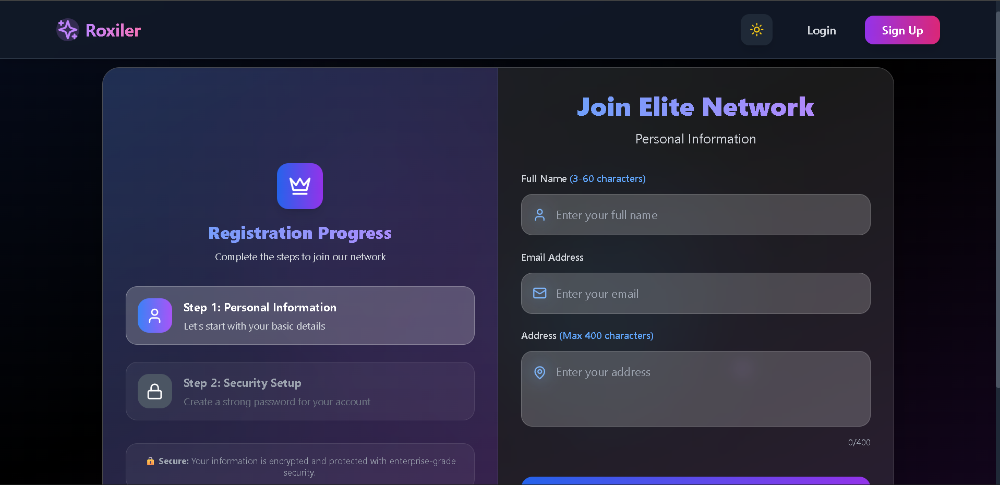 |  |

</div>

### 👑 System Administrator Dashboard
<div align="center">

| Admin Overview | User Management |
|:---:|:---:|
| 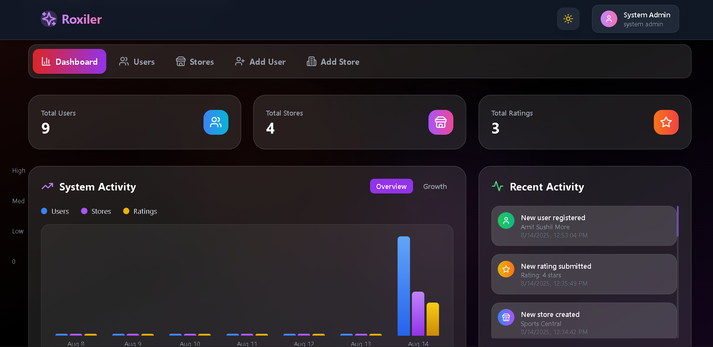 | 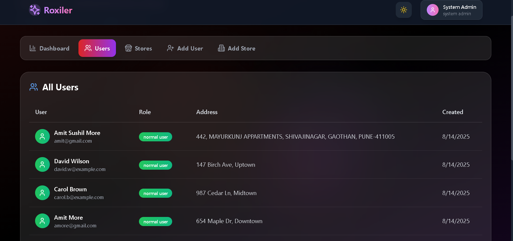 |

| Store Management | Analytics View |
|:---:|:---:|
| 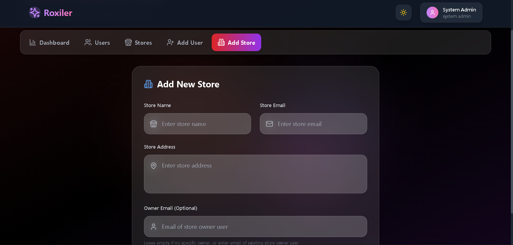 |  |

</div>

### 👤 Customer Dashboard
<div align="center">

| Store Rating Interface | Customer Reviews |
|:---:|:---:|
| 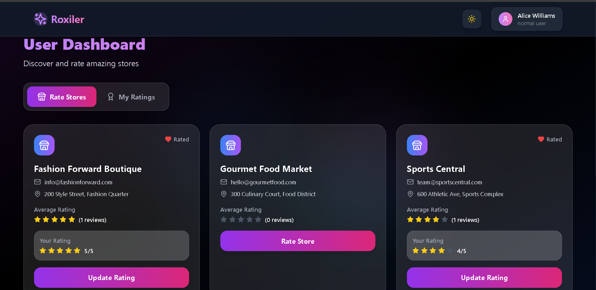 |  |

| Rating Submission | Rating History |
|:---:|:---:|
| 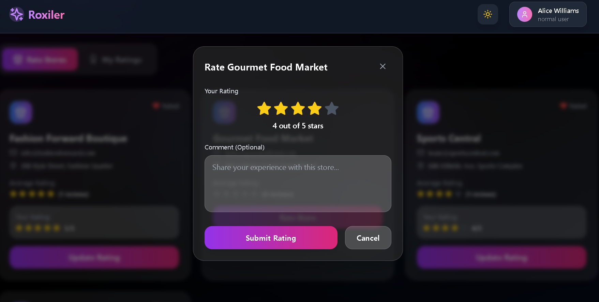 | 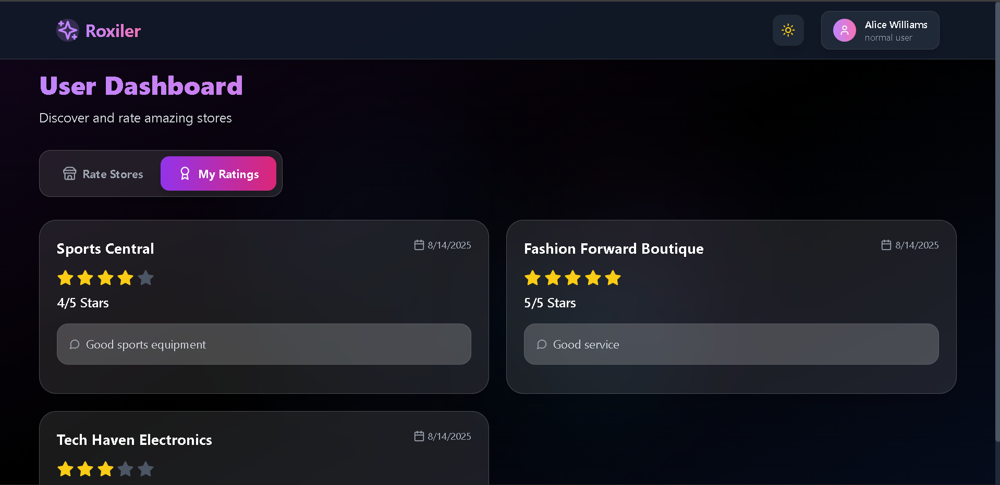 |

</div>

### 🏪 Store Owner Dashboard
<div align="center">

| Store Overview | Customer Feedback |
|:---:|:---:|
| 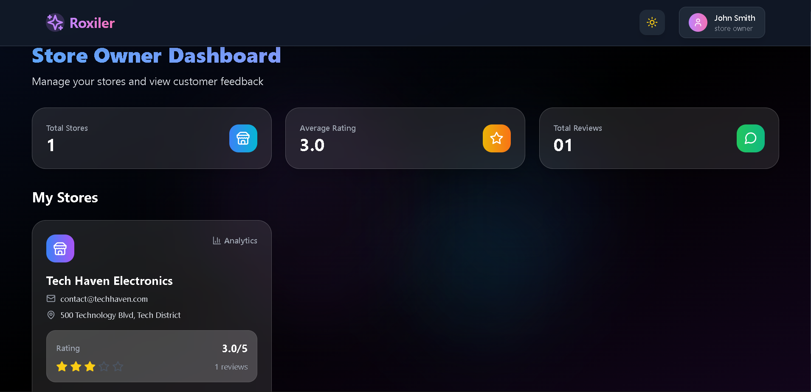 |  |

| Performance Analytics | Review Management |
|:---:|:---:|
|  |  |

</div>

---

## 🛠️ Technology Stack

<div align="center">

### Frontend Technologies


### Backend Technologies


</div>

### 🎯 Core Features

| Feature | Description | Status |
|---------|-------------|--------|
| **Authentication** | JWT-based secure login system | ✅ Complete |
| **Role Management** | Three-tier user hierarchy | ✅ Complete |
| **Store Rating** | 1-5 star rating with comments | ✅ Complete |
| **Real-time Updates** | Live data synchronization | ✅ Complete |
| **Theme Toggle** | Dark/Light mode switching | ✅ Complete |
| **Responsive Design** | Mobile-first approach | ✅ Complete |
| **Data Analytics** | Comprehensive reporting | ✅ Complete |
| **Security** | Role-based access control | ✅ Complete |

---

## 🚀 Quick Start Guide

### 📋 Prerequisites

Ensure you have the following installed:
- **Node.js** `v16.0.0+` - [Download](https://nodejs.org/)
- **PostgreSQL** `v12.0.0+` - [Download](https://postgresql.org/)
- **Git** - [Download](https://git-scm.com/)
- **npm** or **yarn** package manager

### 📥 Installation Steps

#### 1. **Clone the Repository**
```bash
git clone https://github.com/your-username/roxiler.git
cd Roxiler
```

#### 2. **Database Configuration**
```sql
-- Connect to PostgreSQL and create database
CREATE DATABASE store_rating_system;
```

#### 3. **Backend Setup**
```bash
cd backend
npm install

# Create environment file
cp .env.example .env
# Edit .env with your database credentials
```

**Environment Configuration:**
```env
# Database Configuration
DB_USER=postgres
DB_HOST=localhost
DB_NAME=store_rating_system
DB_PASSWORD=your_secure_password
DB_PORT=5432

# Security
JWT_SECRET=your_super_secure_jwt_secret_key_here

# Server
PORT=5000
```

**Initialize Database:**
```bash
npm run init-db
```

**Start Backend Server:**
```bash
npm run dev
```

#### 4. **Frontend Setup**
```bash
cd ../frontend
npm install
npm run dev
```

### 🎉 Access the Application

- **Frontend:** [http://localhost:3000](http://localhost:3000)
- **Backend API:** [http://localhost:5000](http://localhost:5000)

---

## 🔐 Default Access Credentials

### System Administrator
```
Email: admin@roxiler.com
Password: admin123
```

> **Note:** Change default credentials in production environment

---

## 👥 User Roles & Capabilities

### 🛡️ System Administrator
**Complete System Control**

**Dashboard Features:**
- 📊 Real-time analytics (Total Users, Stores, Ratings)
- 📈 Growth metrics and performance indicators
- 🔍 System health monitoring

**User Management:**
- ➕ Create new users (All roles)
- 👀 View comprehensive user list
- ✏️ Edit user permissions and details
- 🗑️ Manage user accounts

**Store Management:**
- 🏪 Create and configure stores
- 👨‍💼 Assign store owners
- 📍 Manage store locations and details
- 📊 Monitor store performance

**Testing Workflow:**
```
1. Login with admin credentials
2. Navigate: Dashboard → Users → Add User
3. Create store owners and customers
4. Navigate: Stores → Add Store
5. Assign stores to owners
6. Monitor system statistics
```

### 👤 Customer (Normal User)
**Store Rating & Review System**

**Rating Features:**
- ⭐ Submit 1-5 star ratings
- 💬 Write detailed reviews
- ✏️ Update existing ratings
- 📝 View personal rating history

**Discovery Features:**
- 🔍 Browse all available stores
- 📊 View store average ratings
- 👥 See total review counts
- 🎯 Filter and search stores

**Testing Workflow:**
```
1. Register new account OR use admin-created account
2. Navigate: Rate Stores
3. Select stores and submit ratings
4. Add meaningful comments
5. Check: My Ratings → View history
6. Update existing ratings
```

### 🏪 Store Owner
**Business Analytics & Customer Insights**

**Store Management:**
- 🏪 View assigned stores
- 📊 Monitor store performance
- ⭐ Track average ratings
- 📈 View rating trends

**Customer Insights:**
- 💬 Read customer reviews
- 👥 View reviewer details
- 📅 Track review timeline
- 🎯 Analyze feedback patterns

**Testing Workflow:**
```
1. Login with store owner account
2. View: My Stores
3. Select store → View Ratings
4. Analyze customer feedback
5. Monitor performance metrics
```

---

## 🌐 API Documentation

### 🔐 Authentication Endpoints
```http
POST /api/auth/login          # User authentication
POST /api/auth/register       # Customer registration
GET  /api/auth/me            # Current user profile
```

### 👑 Admin Endpoints (Admin Only)
```http
GET  /api/admin/dashboard    # System statistics
POST /api/admin/users        # Create new user
POST /api/admin/stores       # Create new store
GET  /api/admin/users        # List all users
GET  /api/admin/stores       # List all stores
```

### 👤 User Endpoints (Authenticated)
```http
GET  /api/user/stores        # Available stores
POST /api/user/ratings       # Submit/update rating
GET  /api/user/my-ratings    # User's rating history
```

### 🏪 Store Endpoints (Store Owners)
```http
GET /api/store/my-stores           # Owned stores
GET /api/store/:storeId/ratings    # Store ratings
```

---

## 🗄️ Database Architecture

### 📊 Entity Relationship Diagram

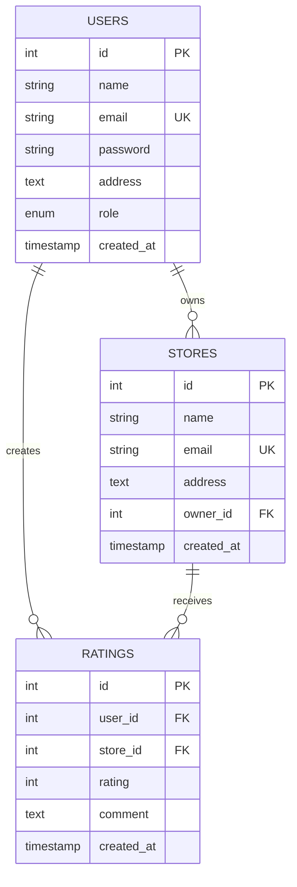

### 🔗 Table Relationships

| Table | Relationship | Description |
|-------|--------------|-------------|
| **Users → Stores** | One-to-Many | Store owners can own multiple stores |
| **Users → Ratings** | One-to-Many | Users can rate multiple stores |
| **Stores → Ratings** | One-to-Many | Stores can receive multiple ratings |
| **Users + Stores** | Unique Constraint | One rating per user per store |

---

## 🧪 Comprehensive Testing Guide

### 🔄 End-to-End Testing Workflow

#### **Phase 1: System Setup**
```bash
# 1. Initialize database
npm run init-db

# 2. Start services
npm run dev          # Backend
npm run dev          # Frontend (separate terminal)

# 3. Verify services
curl http://localhost:5000/api/auth/me
curl http://localhost:3000
```

#### **Phase 2: Admin Testing**
```
1. Login: admin@roxiler.com / admin123
2. Create Users:
   - 3 Store Owners
   - 5 Customers
   - Verify different roles
3. Create Stores:
   - 8-10 diverse stores
   - Assign to different owners
4. Verify Dashboard Statistics
```

#### **Phase 3: Customer Testing**
```
1. Login as different customers
2. Rate stores (vary ratings 1-5)
3. Add diverse comments
4. Update existing ratings
5. Check rating history
6. Verify real-time updates
```

#### **Phase 4: Store Owner Testing**
```
1. Login as store owners
2. View assigned stores
3. Check customer ratings
4. Analyze feedback
5. Monitor performance
```

#### **Phase 5: Integration Testing**
```
1. Cross-role interactions
2. Data consistency checks
3. Security boundary testing
4. Theme toggle verification
5. Responsive design testing
```

### 📝 Sample Test Data

#### **Users to Create:**
```javascript
// Store Owners
[
  { name: "Alice Johnson", email: "alice@example.com", role: "store_owner" },
  { name: "Bob Smith", email: "bob@example.com", role: "store_owner" },
  { name: "Carol Davis", email: "carol@example.com", role: "store_owner" }
]

// Customers
[
  { name: "David Wilson", email: "david@example.com", role: "normal_user" },
  { name: "Emma Brown", email: "emma@example.com", role: "normal_user" },
  { name: "Frank Miller", email: "frank@example.com", role: "normal_user" }
]
```

#### **Stores to Create:**
```javascript
[
  { name: "Tech Haven Electronics", owner: "alice@example.com" },
  { name: "Fashion Forward Boutique", owner: "bob@example.com" },
  { name: "Gourmet Food Market", owner: "carol@example.com" },
  { name: "Sports Central", owner: "alice@example.com" },
  { name: "Home & Garden Paradise", owner: "bob@example.com" }
]
```

---

## 🎨 UI/UX Features

### 🌓 Theme System
- **Light Mode:** Clean, professional interface
- **Dark Mode:** Modern, eye-friendly design
- **Auto-persistence:** Remembers user preference
- **Smooth Transitions:** Seamless mode switching

### 📱 Responsive Design
- **Mobile-First:** Optimized for mobile devices
- **Tablet-Friendly:** Perfect tablet experience
- **Desktop-Enhanced:** Rich desktop interface
- **Cross-Browser:** Compatible with all modern browsers

### ✨ Interactive Elements
- **Smooth Animations:** Framer Motion powered
- **Loading States:** Beautiful loading indicators
- **Form Validation:** Real-time input validation
- **Toast Notifications:** User-friendly feedback

---

## 🔧 Development & Deployment

### 🏗️ Project Structure
```
Roxiler/
├── 🌐 frontend/
│   ├── 📁 src/
│   │   ├── 🧩 components/     # Reusable UI components
│   │   ├── 🔄 context/        # React contexts
│   │   ├── 📄 pages/          # Page components
│   │   ├── 🎨 styles/         # CSS and themes
│   │   └── ⚙️ utils/          # Utility functions
│   ├── 📁 public/
│   │   └── 📁 assets/         # Images and static files
│   └── 📋 package.json
├── ⚙️ backend/
│   ├── 🛣️ routes/             # API endpoints
│   ├── 🛡️ middleware/         # Authentication & validation
│   ├── 📊 models/             # Database models
│   ├── 🔧 scripts/            # Database scripts
│   └── 📋 package.json
└── 📖 README.md
```

### 🚀 Build & Deployment
```bash
# Production build
npm run build          # Frontend
npm run start          # Backend production

# Docker deployment
docker-compose up -d

# Environment setup
cp .env.example .env
# Configure production variables
```

---

## 🛡️ Security Features

- 🔐 **JWT Authentication:** Secure token-based auth
- 🛡️ **Role-Based Access:** Granular permission control
- 🔒 **Password Hashing:** bcrypt encryption
- 🚫 **SQL Injection Prevention:** Parameterized queries
- ⚡ **Rate Limiting:** API abuse prevention
- 🔍 **Input Validation:** Comprehensive data validation

---

## 🤝 Contributing

We welcome contributions! Please see our [Contributing Guidelines](CONTRIBUTING.md) for details.

### 📝 Development Setup
```bash
# Fork repository
git clone https://github.com/your-username/roxiler.git

# Create feature branch
git checkout -b feature/amazing-feature

# Make changes and commit
git commit -m "Add amazing feature"

# Push and create pull request
git push origin feature/amazing-feature
```

---

## 📄 License

This project is licensed under the MIT License - see the [LICENSE](LICENSE) file for details.

---

## 🆘 Support & Troubleshooting

### Common Issues & Solutions

| Issue | Solution |
|-------|----------|
| **Database Connection Failed** | Check PostgreSQL service and credentials |
| **Port Already in Use** | Kill process: `kill -9 $(lsof -ti:5000)` |
| **JWT Token Invalid** | Clear localStorage and re-login |
| **Build Fails** | Clear cache: `npm run clean && npm install` |

### 📞 Get Help
- 🐛 **Bug Reports:** [GitHub Issues](https://github.com/your-username/roxiler/issues)
- 💡 **Feature Requests:** [GitHub Discussions](https://github.com/your-username/roxiler/discussions)
- 📧 **Email Support:** support@roxiler.com

---

<div align="center">

### 🌟 Star this project if you found it helpful!

**Built with ❤️ by the Roxiler Team**

[](https://github.com/your-username/roxiler)
[](https://github.com/your-username/roxiler/fork)

</div>
